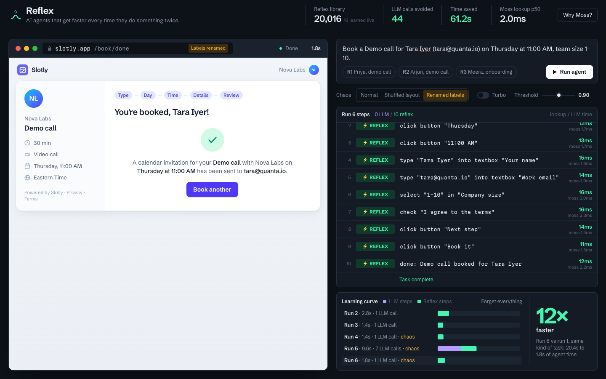

# Reflex

**AI agents that get faster every time they do something twice.**

Browser and computer-use agents think through every step from scratch: one LLM round trip per click, every time. Reflex gives an agent muscle memory. Before each step it asks **Moss** *"have I been in exactly this situation before?"* That lookup takes about 1 ms. On a confident, verified match it replays the remembered action **without calling the LLM**. When anything looks unfamiliar, the LLM handles just that step, and Reflex learns from it.



## Measured results (localhost, MacBook Air M3, Groq `gpt-oss-120b`)

| Run | Condition | Agent time | LLM calls | Steps (🧠 LLM · ⚡ reflex · ↩ fallback) |
|---|---|---|---|---|
| 1 | Cold, never seen this flow | 11.5 s | 11 | 🧠🧠🧠🧠🧠🧠🧠🧠🧠🧠 |
| 2 | Same flow, different person/day/time | **1.8 s** | **1** (parse only) | ⚡⚡⚡⚡⚡⚡⚡⚡⚡⚡ |
| 3 | Rephrased instruction, different meeting type | 1.3 s | 1 | ⚡⚡⚡⚡⚡⚡⚡⚡⚡⚡ |
| 4 | **Shuffled layout** (same labels, everything reordered) | 0.9 s | 1 | ⚡⚡⚡⚡⚡⚡⚡⚡⚡⚡ |
| 5 | **Renamed labels** ("Full name"→"Your name", "Confirm booking"→"Book it", …) | 10.7 s | 7 | ⚡⚡⚡🧠🧠🧠🧠🧠↩⚡ |
| 6 | Renamed labels again: relearned | 1.05 s | 1 | ⚡⚡⚡⚡⚡⚡⚡⚡⚡⚡ |

These come from `scripts/e2e.ts` with no display delay. Run 1 varies between 11 and 20 s with Groq latency. In the UI a warm run is typically **9–13× faster** than the cold one.

**Lookup latency** (`GET /api/reflex/bench`, 200 queries against 20,016 stored reflexes, embedding excluded):

| | p50 | p99 |
|---|---|---|
| Moss in-process index | **0.6–0.8 ms** | 1–8 ms |
| Brute-force exact scan (typed-array dot products) | 9.3–9.9 ms | 13–42 ms |

A full reflex lookup takes about 10 ms end to end: ~6 ms to embed the page state with MiniLM q8, ~2–3 ms for the Moss top-10 query with a flow filter, plus exact rescoring. An LLM step takes 0.5–3 s.

## How it works

```mermaid
flowchart LR
  subgraph Browser
    A[Target web app<br/>Slotly] -->|DOM snapshot| S[State key<br/>route + heading + elements<br/>slot values → {name},{day}…]
    L[Agent loop]
  end
  subgraph Node server
    E[MiniLM q8 embedder<br/>~6 ms] --> M[(Moss session<br/>in-process index<br/>20k reflexes)]
    M -->|top-10 + flow filter<br/>~1 ms| G{Gates}
    Q[Groq LLM<br/>tool calling]
  end
  S --> L -->|lookup| E
  G -->|match: cosine ≥ τ<br/>AND exact form state| L
  L -->|⚡ replay action<br/>no LLM| A
  G -->|no match| Q -->|🧠 action| L
  L -->|learn: pre-state → action → post-state| M
```

1. **Templated state.** The page is snapshotted into interactive elements (role, label, value). Task values extracted from the instruction by one LLM parse call (`name`, `email`, `day`, `time`, …) are replaced by placeholders, so "Priya on Thursday" and "Arjun on Friday" produce the **same** state key.
2. **Reflex lookup (Moss).** The state key is embedded and queried against the Moss session, which is an in-process index holding every step ever learned. Moss returns the top 10 within the task's flow. Candidates are then rescored by exact cosine, because Moss scores are rank-fused.
3. **Three gates before acting:**
   - **Similarity:** cosine ≥ τ (default 0.90).
   - **Exact form state:** form-field states must match exactly. "Name empty" vs "name filled" pages embed at cosine 0.991, so similarity alone would replay the wrong step.
   - **Target resolution:** the templated target (e.g. button `{day}`) must resolve to exactly one element on the live page.
4. **Post-condition.** After a reflex acts, the page must land on the remembered route and heading, otherwise the reflex is penalised. Reflexes that keep failing are pruned.
5. **Fallback and learning.** Any step that isn't a confident reflex goes to the LLM. The resulting (state → action → post-state) is learned immediately (~65 ms add), so the very next run benefits.

**Why this is different from "agent memory".** Workflow memory and plan caching put past experience back into the prompt, so every step still pays full LLM latency. Reflex **skips the LLM call entirely** at step granularity, and only when verified gates pass.

## Why Moss

- **The lookup runs on the hot path of every single step.** It replaces an LLM call, so it has to cost about as much as a DOM action, not a network round trip.
- **Learning must be instant.** `session()` indexes locally: a new reflex is queryable ~65 ms after it's learned, and queries take under 1 ms. Moss cloud operations (create, add, load) take 7–30 s, so they belong in background sync (`pushIndex`), never in the loop.
- **The library only grows.** Every step of every run by every agent adds a reflex. At 20k reflexes, Moss is about 12× faster than an exact scan at p50, and that gap widens with size.

## Run it

```bash
pnpm install
cp .env.example .env.local   # MOSS_PROJECT_ID, MOSS_PROJECT_KEY, GROQ_API_KEY
pnpm exec tsx scripts/seed-synthetic.ts 20000   # optional: 20k synthetic reflexes from 41 other flows (~2.5 min)
pnpm build && pnpm start      # http://localhost:3000
```

The embedding model (`Xenova/all-MiniLM-L6-v2`, q8, 23 MB) is fetched into `.cache/models` on first use.

Other entry points:
- `http://localhost:3000/harness` is a bare harness page.
- `pnpm exec tsx scripts/e2e.ts` runs the six-run sequence above.
- `pnpm exec tsx scripts/demo.ts` drives the real UI and records `out/demo/`.
- `pnpm exec tsx --env-file=.env.local scripts/test-engine.ts` runs the engine tests.

**Hosting:** this needs a long-running Node server, not serverless, because the Moss session lives in process memory. Render, Railway, Fly or any VM with `pnpm start` will work.

## Honest limitations
- The target is a mock scheduling app we built, so we can reset it and inject layout chaos on demand. The agent only sees it through the DOM, exactly as it would a real site.
- One LLM call per run remains: parsing the instruction into slots. A template cache for instruction phrasing would remove it too.
- A post-condition failure is detected after the action. Reversible UIs are fine; destructive actions would need a pre-commit check.
- Built-in Moss models returned 401 for our project, so we supply our own 384-d MiniLM embeddings (`modelId: "custom"`).
- The synthetic reflexes (other flows) exist to measure lookup at realistic library sizes and are labelled as synthetic everywhere.

## Layout
```
src/target/     Slotly: mock SaaS target app (normal / shuffled / renamed variants)
src/agent/      browser agent: DOM snapshot, executor, reflex/LLM loop
src/server/     embedder (transformers.js), reflexStore (Moss session + gates), groq client
src/app/api/    /api/reflex/{lookup,learn,feedback,stats,reset,bench}, /api/llm/{parse,step}
src/ui/         mission-control UI
src/lib/        shared contracts + slot templating
docs/           PRD, architecture diagram
```
